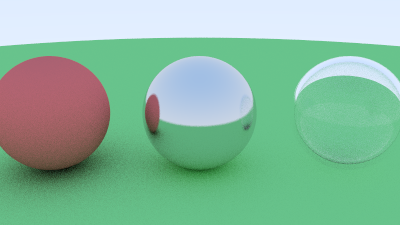

# Mini Path Tracer

Un ray tracer / path tracer écrit from scratch en C++, sans bibliothèque graphique externe. Implémente le rendu physique par Monte Carlo, plusieurs matériaux (diffus, métal, verre), une caméra configurable et un rendu multithreadé.

## Fonctionnalités

- **Rendu par path tracing** : simulation physique de la lumière par Monte Carlo (rebonds aléatoires, moyennés sur plusieurs échantillons par pixel)
- **Matériaux** :
  - Diffus (Lambertian)
  - Métal avec effet de flou réglable (fuzz)
  - Verre (Dielectric) avec réflexion/réfraction selon l'angle (approximation de Schlick)
- **Caméra configurable** : position, cible, champ de vision (field of view)
- **Anti-aliasing** par supersampling
- **Rendu multithreadé** : parallélisation automatique sur tous les cœurs CPU disponibles (~8x plus rapide sur une machine 8 threads)

## Compilation

Prérequis : CMake 3.10+, compilateur C++17 (g++/clang)

\`\`\`bash
mkdir build && cd build
cmake ..
make
./path_tracer
\`\`\`

Génère une image output.ppm dans le dossier build/.

## Structure du projet

\`\`\`
src/
├── main.cpp        # Boucle de rendu, définition de la scène et de la caméra
├── vec3.h           # Classe vecteur 3D (opérations de base)
├── ray.h            # Représentation d'un rayon (origine + direction)
├── hit_record.h     # Structure décrivant une intersection
├── sphere.h         # Géométrie : intersection rayon/sphère
└── material.h       # Matériaux : Lambertian, Metal, Dielectric
\`\`\`

## Ce que ce projet démontre

Projet réalisé en autonomie en parallèle de mon M2 GIG (Géométrie Informatique Graphique) à Aix-Marseille Université, pour approfondir les fondamentaux mathématiques du rendu 3D (vecteurs, intersections géométriques, éclairage physique) avant d'attaquer un moteur de rendu temps réel (OpenGL/Vulkan).

Inspiré de la méthode décrite dans [Ray Tracing in One Weekend](https://raytracing.github.io/) de Peter Shirley.
